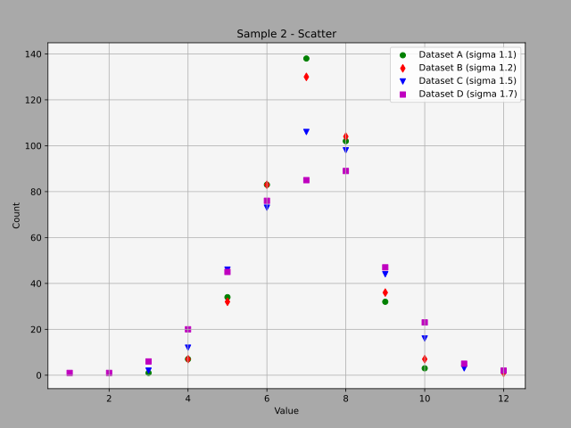

# ChartBuilder
Simple module for building charts &amp; diagrams, based on matplotlib library

## Requirements:

    - matplotlib
    
    - pillow
    
## Usage:

```python
    
    from chartbuilder import Scatter, Pie, Bar, LineGraph, Hist, ChartDataHelper as CDH
    
```

### Scatter Diagram with multiple data source:

```python
    
    p1 = Scatter('Sample 1 - Scatter', 'Value X', 'Value Y')
    
    p1.setFaceColor('darkgray', alpha = 0.5)    ## Optional, set background color (base colors or CSS4)
    
    p1.setBgColor('whitesmoke', alpha = 0.9)    ## Optional, set chart background color (base colors or CSS4)
    
    #p1.setFontColor('white')                   ## Optional, set title, axis labels, x & y ticks color (base colors or CSS4)
    
    #p1.setBgImage('img/bgimage.jpg')           ## Optional, set chart background image
    
    #p1.HideTicks()                             ## Optional, hide x & y ticks & disable grid
    
    #p1.DisableGrid()                           ## Optional, disable grid
    
    data = []
    
    data.append(p1.ScatterData(a, 'Dataset A', 'g'))
    
    data.append(p1.ScatterData(b, 'Dataset B', 'b'))
    
    data.append(p1.ScatterData(c, 'Dataset C', 'r'))
    
    p1.fileToSave('result/01_scatter-1.svg')    ## Optional, file to save current chart
    
    p1.Plot(*data)
    
```




### Line Graph(s) with multiple data source:

```python
    
    p3 = LineGraph('Sample 3 - Line Diagram', 'Value', 'Count')
    
    p3.setFaceColor('darkgray', alpha = 0.5)    ## Optional, set background color (base colors or CSS4)
    
    p3.setBgColor('whitesmoke', alpha = 0.9)    ## Optional, set chart background color (base colors or CSS4)
    
    #p3.setFontColor('white')                   ## Optional, set title, axis labels, x & y ticks color (base colors or CSS4)
    
    #p3.setBgImage('img/bgimage.jpg')           ## Optional, set chart background image
    
    #p3.HideTicks()                             ## Optional, hide x & y ticks & disable grid
    
    #p3.DisableGrid()                           ## Optional, disable grid
    
    data = []
    
    data.append(p3.LineData(ac, 'Dataset A (sigma 1.1)', 'r'))
    
    data.append(p3.LineData(bc, 'Dataset B (sigma 1.2)', 'g'))
    
    data.append(p3.LineData(cc, 'Dataset C (sigma 1.5)', 'b'))
    
    data.append(p3.LineData(dc, 'Dataset D (sigma 1.7)', 'm'))
    
    p3.fileToSave('result/03_linegraph.svg')    ## Optional, file to save current chart
    
    p3.Plot(*data)
    
```


### Histogram(s):

```python
    
    p5 = Hist('Sample 5 - Histogram', 'Value', 'Count')
    
    p5.setFaceColor('darkgray', alpha = 0.5)    ## Optional, set background color (base colors or CSS4)
    
    p5.setBgColor('whitesmoke', alpha = 0.9)    ## Optional, set chart background color (base colors or CSS4)
    
    #p5.setFontColor('white')                   ## Optional, set title, axis labels, x & y ticks color (base colors or CSS4)
    
    #p5.setBgImage('img/bgimage.jpg')           ## Optional, set chart background image
    
    #p5.HideTicks()                             ## Optional, hide x & y ticks & disable grid
    
    #p5.DisableGrid()                           ## Optional, disable grid
    
    data = []
    
    data.append(p5.HistData(a, 10, 'Dataset A','r'))
    
    data.append(p5.HistData(b, 10, 'Dataset B', 'g'))
    
    p5.fileToSave('result/05_histogram.svg')    ## Optional, file to save current chart
    
    p5.Plot(*data)
    
```


### Different Bar diagrams:

```python
    
    p7 = Bar('Sample 7 - Bar diagram with custom names on x-axis and % on y-axis (histogram in %)', 'Range', '% of values')
    
    p7.setFaceColor('darkgray', alpha = 0.5)    ## Optional, set background color (base colors or CSS4)
    
    p7.setBgColor('whitesmoke', alpha = 0.9)    ## Optional, set chart background color (base colors or CSS4)
    
    #p7.setFontColor('white')                   ## Optional, set title, axis labels, x & y ticks color (base colors or CSS4)
    
    #p7.setBgImage('img/bgimage.jpg')           ## Optional, set chart background image
    
    #p7.HideTicks()                             ## Optional, hide x & y ticks & disable grid
    
    #p7.DisableGrid()                           ## Optional, disable grid
    
    p7.setXTicks(item_names)                    ## Optional, set custom values to x-ticks
    
    data = []
    
    data.append(p7.BarData(agp, 'Dataset A', 'c'))
    
    data.append(p7.BarData(bgp, 'Dataset B',  'm'))
    
    p7.fileToSave('result/07_bar.svg')          ## Optional, file to save current chart
    
    p7.Plot(*data)
    
```


### Pie diagrams (with the ability to set a minimum threshold value (in percent)):

```python
    
    p9 = Pie('Sample 9 - Pie Diagramm with custom item`s names')
    
    p9.setFaceColor('darkgray', alpha = 0.5)    ## Optional, set background color (base colors or CSS4)
    
    #p9.setFontColor('white')                   ## Optional, set title, axis labels, x & y ticks color (base colors or CSS4)
    
    #p9.setBgImage('img/bgimage.jpg')           ## Optional, set chart background image
    
    p9.setItemNames(item_names)                 ## Optional, set custom names to pie chart items
    
    data = []
    
    data.append(p9.PieData(ag, 'Dataset A'))
    
    data.append(p9.PieData(bg, 'Dataset B (filtered)', minpercent = 8))
    
    p9.fileToSave('result/09_pie.svg')          ## Optional, file to save current chart
    
    p9.Plot(*data)
    
```


### Tracking (like a scatter diagram) on map (with selected map from image file): 

```python
    
    prepared_map, width, height, corner_points = CDH.map_prepare(f"img/square_map.jpg") ## square map image used as background image

    ac = CDH.data_crop(a, 0, 0, width, height) ## remove points outside the map from the set
    
    bc = CDH.data_crop(b, 0, 0, width, height) ## remove points outside the map from the set

    p10 = Scatter('Square Map')
    
    p10.setSize(width, height)
    
    p10.setBgImage(prepared_map)
    
    p10.HideTicks()
    
    data = []
    
    data.append(p10.ScatterData(corner_points, None, 'k', "+")) ## set corner points
    
    data.append(p10.ScatterData(ac, 'Route A track', 'r'))
    
    data.append(p10.ScatterData(bc, 'Route B track', 'b'))
    
    p10.fileToSave('result/10_square_map.svg')
    
    p10.Plot(*data)
    
```

### Map prepared from image (square):


### Tracking on the map:


### Map prepared from image (rectangular):


### Tracking on the map:


## Samples

Sample datasets and ChartBuilder usage see in test.py

